# Data Model: Enterprise AI Animator Workbench v2.0

**Feature**: `001-animator-workbench-v2`
**Date**: 2026-01-29
**Status**: Draft

## 1. Entity Relationship Diagram (ERD)

```mermaid
erDiagram
    Project ||--o{ Asset : contains
    Asset ||--o{ Asset : "derived from (lineage)"
    Asset ||--o{ Task : "generated by"
    Task }|--|| Asset : "operates on"
    
    Project {
        string id PK
        string name
        datetime created_at
        string root_path
    }

    Asset {
        string id PK
        string project_id FK
        string parent_id FK "Nullable"
        string type "image_base, image_refined, video"
        string file_path
        json metadata "dimensions, size, format"
        json pipeline_info "model, prompt, params"
        boolean is_master_reference
        datetime created_at
    }

    Task {
        string id PK
        string type "refine_face_swap, refine_inpainting, convert, generate_video"
        string status "pending, processing, completed, failed"
        string target_asset_id FK "Asset being created"
        string source_asset_id FK "Input asset"
        json parameters "strength, prompt, mask"
        string error_message
        datetime created_at
        datetime updated_at
    }
```



## 2. Entities Definition

### 2.1 Asset
Represents a media file (Image/Video) managed by the workbench.

| Field | Type | Description | Validation |
|-------|------|-------------|------------|
| `id` | String (UUID) | Unique identifier | Required |
| `projectId` | String (UUID) | Project ownership | Required |
| `parentId` | String (UUID)? | Source asset ID (for lineage) | Optional (Root assets have null) |
| `type` | Enum | `imageBase`, `imageRefined`, `video` | Required |
| `filePath` | String | Absolute local path | Must exist on disk |
| `metadata` | Map<String, dynamic> | Technical details (width, height) | - |
| `pipelineInfo` | Map<String, dynamic> | AI generation params (Model, Seed) | - |
| `isMasterReference` | Boolean | If true, used for character consistency | Default: false |
| `createdAt` | DateTime | Creation timestamp | Required |

### 2.2 Task
Represents a background operation (AI processing, File IO).

| Field | Type | Description | Validation |
|-------|------|-------------|------------|
| `id` | String (UUID) | Unique identifier | Required |
| `type` | Enum | `faceSwap`, `inpainting`, `upscale`, `videoGeneration` | Required |
| `status` | Enum | `pending`, `processing`, `completed`, `failed` | Required |
| `sourceAssetId` | String (UUID) | Input asset ID | Required |
| `targetAssetId` | String (UUID) | Output asset ID (placeholder until done) | Required |
| `parameters` | Map<String, dynamic> | Operation specific config | - |
| `errorMessage` | String? | Failure reason | Present if status=failed |
| `progress` | Double | 0.0 to 1.0 | Default: 0.0 |

## 3. Storage Schema (SQLite)

### Table: `assets`
```sql
CREATE TABLE assets (
    id TEXT PRIMARY KEY,
    project_id TEXT NOT NULL,
    parent_id TEXT,
    type TEXT NOT NULL,
    file_path TEXT NOT NULL,
    metadata TEXT, -- JSON string
    pipeline_info TEXT, -- JSON string
    is_master_reference INTEGER DEFAULT 0,
    created_at INTEGER NOT NULL,
    FOREIGN KEY(parent_id) REFERENCES assets(id)
);
```

### Table: `tasks`
```sql
CREATE TABLE tasks (
    id TEXT PRIMARY KEY,
    type TEXT NOT NULL,
    status TEXT NOT NULL,
    source_asset_id TEXT NOT NULL,
    target_asset_id TEXT NOT NULL,
    parameters TEXT, -- JSON string
    error_message TEXT,
    created_at INTEGER NOT NULL,
    updated_at INTEGER NOT NULL,
    FOREIGN KEY(source_asset_id) REFERENCES assets(id),
    FOREIGN KEY(target_asset_id) REFERENCES assets(id)
);
```

## 4. State Management (Riverpod)

### 4.1 Providers
- `assetListProvider(projectId)`: `StreamProvider<List<Asset>>`
  - Listens to SQLite changes for a specific project.
- `taskQueueProvider`: `StateNotifierProvider<TaskQueueNotifier, List<Task>>`
  - Manages the global background task queue.
- `masterReferenceProvider`: `Provider<Asset?>`
  - Holds the currently selected character reference.

### 4.2 Actions
- `queueRefinementTask(sourceAsset, params)`:
  1. Creates a placeholder `Asset` (status: generating).
  2. Creates a `Task` record (status: pending).
  3. Persists both to SQLite.
  4. Notifies `TaskQueueService` to pick up the task.
