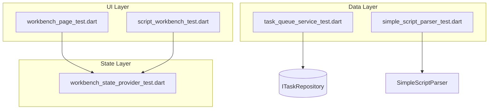

# Documentation: Enterprise AI Animator Workbench v2.0

## Overview

The Enterprise AI Animator Workbench v2.0 is a Flutter-based application designed for professional animators. It features a "Hybrid Model Pipeline" that allows users to queue complex image refinement tasks (like Face Swap and Inpainting) asynchronously without blocking the UI.

## Key Features

1.  **Asynchronous Task Queue**: Queue heavy AI operations and continue working. Tasks persist across app restarts.
2.  **Asset Lineage**: Track the history of every asset, including its parent image and the parameters used to generate it.
3.  **Local-First Architecture**: Assets are stored locally, with metadata managed in a SQLite database.
4.  **Extensible AI Integration**: Designed with an Adapter pattern to easily swap between different AI providers (Mock, OpenAI, Stable Diffusion, etc.).

## Architecture

The project follows **Clean Architecture** principles:

-   **Domain Layer**: Contains Entities (`Asset`, `Task`) and Interfaces (`IAssetRepository`, `IGenerativeImageService`). Independent of Flutter and data sources.
-   **Data Layer**: Implements Repositories and Data Sources. Handles SQLite (`DatabaseHelper`) and API calls.
-   **Presentation Layer**: UI components and State Management using **Riverpod**.

## Getting Started

### Prerequisites

-   Flutter SDK 3.x
-   Dart SDK 3.x
-   Windows, macOS, or Linux environment (for desktop support)

### Installation

1.  Clone the repository.
2.  Run `flutter pub get` to install dependencies.
3.  Run `flutter run -d windows` (or macos/linux) to start the app.

### Usage

1.  **View Assets**: The main screen shows a grid of your assets.
2.  **Refine an Asset**: Click the "Add Photo" icon in the app bar (simulated for demo) to open the Refinement Panel.
3.  **Queue Task**: Select a task type (e.g., Face Swap), enter parameters, and click "Queue Refinement".
4.  **Monitor Progress**: A placeholder card will appear in the list. The task will process in the background (simulated delay).
5.  **View Details**: Tap on any asset to view its details and lineage.

## Development

### Directory Structure

```text
lib/features/animator_workbench/
├── data/           # Data layer (Repositories, Models, Data Sources)
├── domain/         # Domain layer (Entities, Interfaces)
└── presentation/   # Presentation layer (Widgets, Pages, Providers)
```

### Adding a New AI Service

1.  Create a new class implementing `IGenerativeImageService` in `data/datasources/remote/`.
2.  Update `dependency_injection.dart` to provide your new service implementation.

## Testing

Run unit tests with:

```bash
flutter test
```

### Test Coverage

The project includes 5 test files covering Data, State, and UI layers:

#### 1. Data Layer
- **`task_queue_service_test.dart`**: Tests `TaskQueueService` initialization and task processing queue logic.
- **`simple_script_parser_test.dart`**: Tests `SimpleScriptParser` for parsing scripts with both English and Chinese keywords.

#### 2. State Management Layer
- **`workbench_state_provider_test.dart`**: Tests `WorkbenchStateNotifier` for module switching, scene selection/expansion, and shot selection.

#### 3. UI Layer
- **`workbench_page_test.dart`**: Tests main application navigation between Storyboard, Script, Characters, and Settings modules.
- **`script_workbench_test.dart`**: Tests `ScriptWorkbench` functionality, including AI analysis triggering and tab switching.

### Test Architecture


