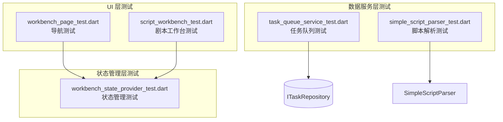

# 测试文档

## 概述

本项目包含 5 个测试文件，覆盖了数据服务层、状态管理层和 UI 层。

## 测试文件分析

### 1. `task_queue_service_test.dart`

**路径**: `test/features/animator_workbench/task_queue_service_test.dart`
**测试对象**: `TaskQueueService` (`lib/features/animator_workbench/data/services/task_queue_service.dart`)

| 测试用例 | 测试内容 |
|---------|---------|
| `should load pending tasks on init` | 验证服务初始化时调用 `getAllTasks()` 加载任务 |
| `should process pending tasks` | 验证 `queueTask()` 后任务状态更新为 `processing` |

**Mock 依赖**: `MockITaskRepository` (使用 Mockito 生成)

### 2. `simple_script_parser_test.dart`

**路径**: `test/features/animator_workbench/data/services/simple_script_parser_test.dart`
**测试对象**: `SimpleScriptParser` (`lib/features/animator_workbench/data/services/simple_script_parser.dart`)

| 测试用例 | 测试内容 |
|---------|---------|
| `parses simple script correctly` | 解析英文关键字脚本 (`SCENE`, `SHOT`)，验证场景/镜头数量和属性 |
| `parses script with Chinese keywords` | 解析中文关键字脚本 (`场景`, `镜头`)，验证国际化支持 |

**无外部依赖**，纯单元测试

### 3. `workbench_page_test.dart`

**路径**: `test/features/animator_workbench/presentation/pages/workbench_page_test.dart`
**测试对象**: 主应用导航功能

| 测试用例 | 测试内容 |
|---------|---------|
| `WorkbenchPage navigation test` | 验证底部导航切换：分镜 → 剧本 → 角色 → 设置 → 分镜 |

**验证点**:
- 初始显示 `StoryboardWorkbench`
- 点击"剧本"显示 `ScriptWorkbench`
- 点击"角色"显示 `CharacterWorkbench`
- 点击"设置"显示占位文本
- 点击"分镜"返回 `StoryboardWorkbench`

### 4. `workbench_state_provider_test.dart`

**路径**: `test/features/animator_workbench/presentation/providers/workbench_state_provider_test.dart`
**测试对象**: `WorkbenchStateNotifier` (`lib/features/animator_workbench/presentation/providers/workbench_state_provider.dart`)

| 测试用例 | 测试内容 |
|---------|---------|
| `initial state is correct` | 验证初始状态：模块=storyboard, 场景=scene_1, 镜头=shot_1 |
| `selectModule updates current module` | 验证模块切换功能 |
| `selectScene behavior` | 验证场景选择的折叠/展开逻辑 |
| `selectShot updates selection` | 验证镜头选择功能 |

**纯状态管理测试**，无 UI 依赖

### 5. `script_workbench_test.dart`

**路径**: `test/features/animator_workbench/presentation/widgets/script_workbench_test.dart`
**测试对象**: `ScriptWorkbench` (`lib/features/animator_workbench/presentation/widgets/script_workbench.dart`)

| 测试用例 | 测试内容 |
|---------|---------|
| `ScriptWorkbench switches tabs and triggers imports` | 验证 AI 分析功能和标签页切换 |

**验证点**:
- 初始显示"AI 智能剧本分析"标签
- 输入文本后点击"开始 AI 分析"触发保存
- 切换到"原始文本导入"标签

**Mock 依赖**: `MockScriptParser`, `MockAIScriptAnalysisService`, `MockScriptImportRepository`

## 测试覆盖架构图

## 测试统计

| 层级 | 文件数 | 测试用例数 |
|-----|-------|----------|
| UI 层 | 2 | 2 |
| 状态管理层 | 1 | 4 |
| 数据服务层 | 2 | 4 |
| **总计** | **5** | **10** |
